# WG Manager — Ablaufdiagramm

> Programmablauf und Funktionalitäten der WG Manager App.  
> Diagramme im [Mermaid](https://mermaid.js.org/)-Format — darstellbar auf GitHub, VS Code (Mermaid-Plugin) oder [mermaid.live](https://mermaid.live).
>
> **Hinweis (Projektstand SoSe 2026):** Die vollständige Ende-zu-Ende-Anbindung an Firebase wurde nicht abgeschlossen.  
> Für die Demo werden Muster-Zugangsdaten pro Rolle verwendet (Passwort: `1234`).

---

## 1. Hauptablauf der App

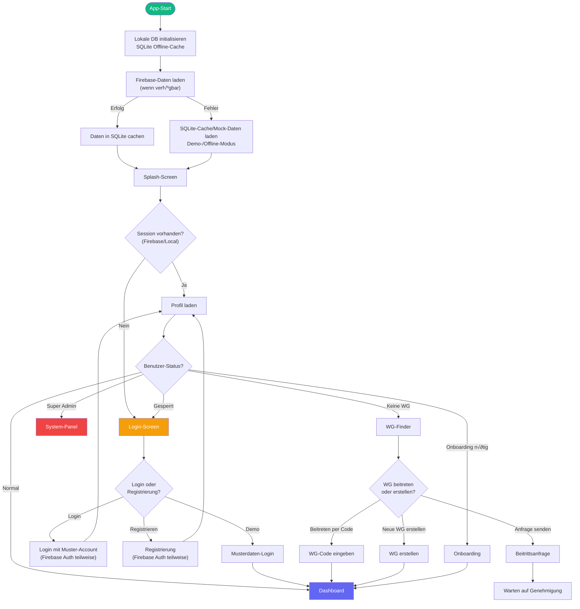
```mermaid
flowchart TD
    A(["App-Start"]) --> B["Lokale DB initialisieren<br/>SQLite Offline-Cache"]
    B --> C["Firebase-Daten laden<br/>(wenn verfügbar)"]
    C -->|Erfolg| D["Daten in SQLite cachen"]
    C -->|Fehler| E["SQLite-Cache/Mock-Daten laden<br/>Demo-/Offline-Modus"]
    D --> F["Splash-Screen"]
    E --> F
    F --> G{"Session vorhanden?<br/>(Firebase/Local)"}
    G -->|Ja| H["Profil laden"]
    G -->|Nein| I["Login-Screen"]
    H --> J{"Benutzer-Status?"}
    J -->|Gesperrt| I
    J -->|Super Admin| K["System-Panel"]
    J -->|Keine WG| L["WG-Finder"]
    J -->|Onboarding nötig| M["Onboarding"]
    J -->|Normal| N["Dashboard"]
    I --> O{"Login oder<br/>Registrierung?"}
    O -->|Login| P["Login mit Muster-Account<br/>(Firebase Auth teilweise)"]
    O -->|Registrieren| Q["Registrierung<br/>(Firebase Auth teilweise)"]
    O -->|Demo| R["Musterdaten-Login"]
    P --> H
    Q --> H
    R --> N
    L --> S{"WG beitreten<br/>oder erstellen?"}
    S -->|Beitreten per Code| T["WG-Code eingeben"]
    S -->|Anfrage senden| U["Beitrittsanfrage"]
    S -->|Neue WG erstellen| V["WG erstellen"]
    T --> N
    U --> W["Warten auf Genehmigung"]
    V --> N
    M --> N

    style A fill:#10b981,color:#fff
    style N fill:#6366f1,color:#fff
    style K fill:#ef4444,color:#fff
    style I fill:#f59e0b,color:#fff
```

---

## 2. Authentifizierungsfluss

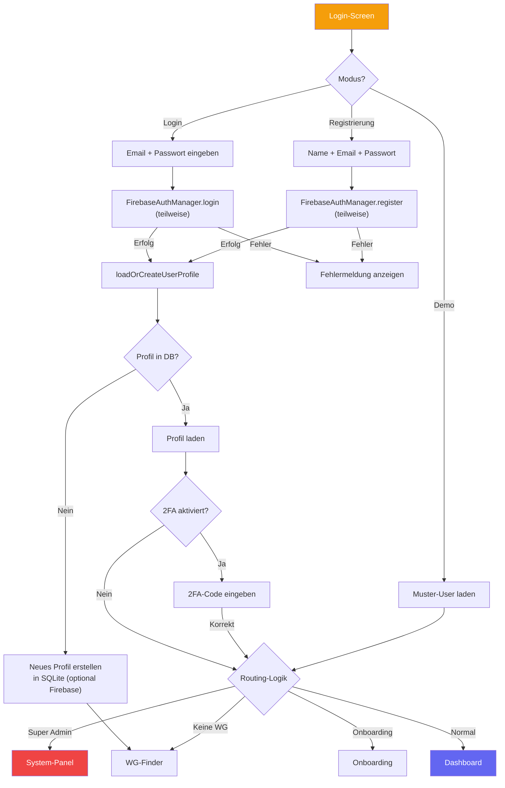
```mermaid
flowchart TD
    A["Login-Screen"] --> B{"Modus?"}
    B -->|Login| C["Email + Passwort eingeben"]
    B -->|Registrierung| D["Name + Email + Passwort"]
    B -->|Demo| E["Muster-User laden"]
    
    C --> F["FirebaseAuthManager.login<br/>(teilweise)"]
    F -->|Erfolg| G["loadOrCreateUserProfile"]
    F -->|Fehler| H["Fehlermeldung anzeigen"]
    
    D --> I["FirebaseAuthManager.register<br/>(teilweise)"]
    I -->|Erfolg| G
    I -->|Fehler| H
    
    G --> J{"Profil in DB?"}
    J -->|Ja| K["Profil laden"]
    J -->|Nein| L["Neues Profil erstellen<br/>in SQLite (optional Firebase)"]
    
    K --> M{"2FA aktiviert?"}
    L --> N["WG-Finder"]
    M -->|Ja| O["2FA-Code eingeben"]
    M -->|Nein| P{"Routing-Logik"}
    O -->|Korrekt| P
    P -->|Super Admin| Q["System-Panel"]
    P -->|Keine WG| N
    P -->|Onboarding| R["Onboarding"]
    P -->|Normal| S["Dashboard"]
    
    E --> P

    style A fill:#f59e0b,color:#fff
    style S fill:#6366f1,color:#fff
    style Q fill:#ef4444,color:#fff
```

### Muster-Zugangsdaten und Rollen-Logik (Demo)

| Rolle | E-Mail | Passwort | Ziel nach Login | Wie es funktionieren soll |
| ----- | ------ | -------- | --------------- | ------------------------- |
| User | `max@wg.com` | `1234` | `DASHBOARD` | Normale WG-Nutzung: Aufgaben, Einkauf, Kalender, Profil |
| Admin | `admin@wg.com` | `1234` | `DASHBOARD` | Wie User, zusätzlich Admin-Aktionen (z. B. WG-Verwaltung/Fixkosten) |
| Super Admin | `super@wg.com` | `1234` | `SYSTEM_PANEL` | Globale Verwaltung: User/WGs verwalten, Impersonation, Wartung |
| User (ohne WG) | `new@wg.com` | `1234` | `WG_FINDER` | Zuerst WG beitreten/erstellen; danach ggf. `ONBOARDING`, dann `DASHBOARD` |

---

## 3. Einkauf & Finanzen

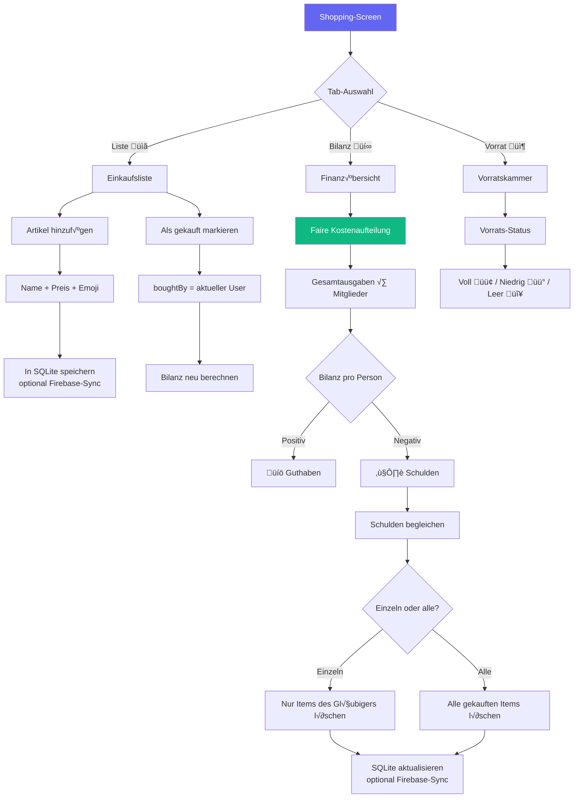
```mermaid
flowchart TD
    A["Shopping-Screen"] --> B{"Tab-Auswahl"}
    B -->|Liste üìã| C["Einkaufsliste"]
    B -->|Bilanz 💰| D["Finanzübersicht"]
    B -->|Vorrat 📦| E["Vorratskammer"]
    
    C --> F["Artikel hinzufügen"]
    F --> G["Name + Preis + Emoji"]
    G --> H["In SQLite speichern<br/>optional Firebase-Sync"]
    
    C --> I["Als gekauft markieren"]
    I --> J["boughtBy = aktueller User"]
    J --> K["Bilanz neu berechnen"]
    
    D --> L["Faire Kostenaufteilung"]
    L --> M["Gesamtausgaben √∑ Mitglieder"]
    M --> N{"Bilanz pro Person"}
    N -->|Positiv| O["üíö Guthaben"]
    N -->|Negativ| P["❤️ Schulden"]
    P --> Q["Schulden begleichen"]
    Q --> R{"Einzeln oder alle?"}
    R -->|Einzeln| S["Nur Items des Gläubigers löschen"]
    R -->|Alle| T["Alle gekauften Items löschen"]
    S --> U["SQLite aktualisieren<br/>optional Firebase-Sync"]
    T --> U
    
    E --> V["Vorrats-Status"]
    V --> W["Voll 🟢 / Niedrig 🟡 / Leer 🔴"]

    style A fill:#6366f1,color:#fff
    style L fill:#10b981,color:#fff
```

---

## 4. Putzplan / Aufgaben

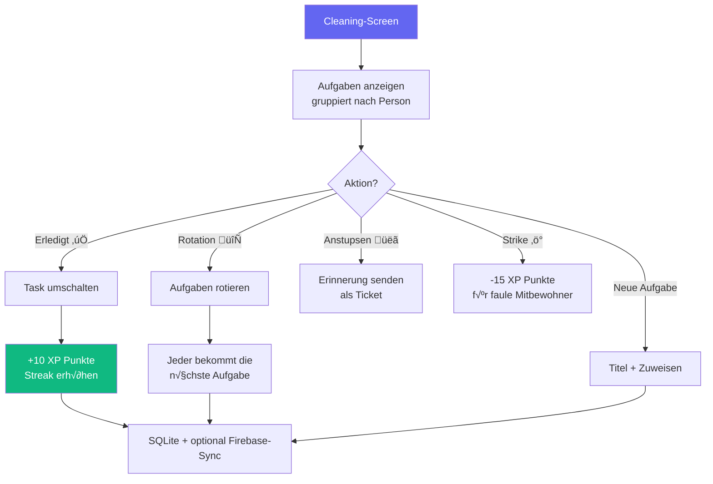
```mermaid
flowchart TD
    A["Cleaning-Screen"] --> B["Aufgaben anzeigen<br/>gruppiert nach Person"]
    B --> C{"Aktion?"}
    C -->|Erledigt ‚úÖ| D["Task umschalten"]
    D --> E["+10 XP Punkte<br/>Streak erhöhen"]
    E --> F["SQLite + optional Firebase-Sync"]
    
    C -->|Rotation 🔄| G["Aufgaben rotieren"]
    G --> H["Jeder bekommt die<br/>nächste Aufgabe"]
    H --> F
    
    C -->|Neue Aufgabe| I["Titel + Zuweisen"]
    I --> F
    
    C -->|Anstupsen üëã| J["Erinnerung senden<br/>als Ticket"]
    C -->|Strike ⚡| K["-15 XP Punkte<br/>für faule Mitbewohner"]

    style A fill:#6366f1,color:#fff
    style E fill:#10b981,color:#fff
```

---

## 5. Kalender

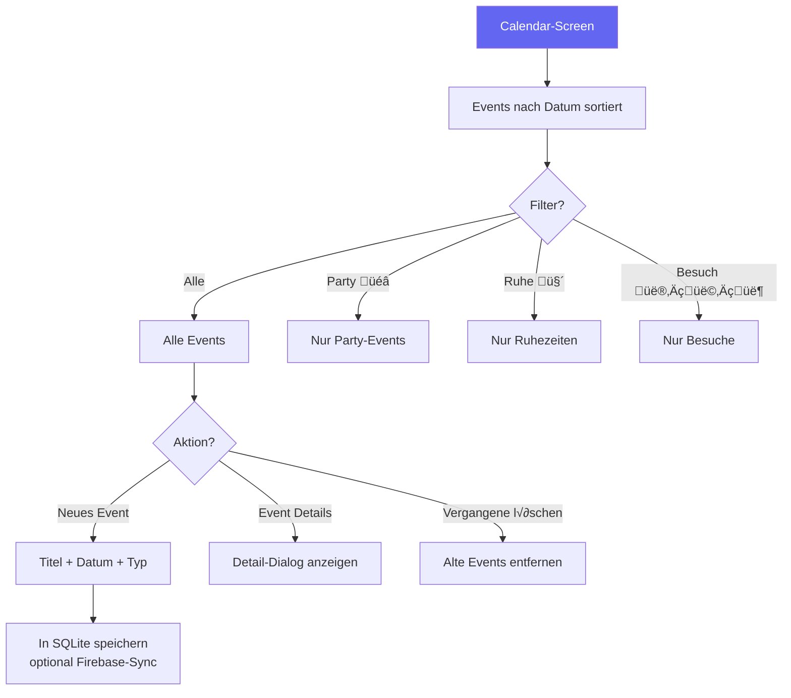
```mermaid
flowchart TD
    A["Calendar-Screen"] --> B["Events nach Datum sortiert"]
    B --> C{"Filter?"}
    C -->|Alle| D["Alle Events"]
    C -->|Party üéâ| E["Nur Party-Events"]
    C -->|Ruhe 🤫| F["Nur Ruhezeiten"]
    C -->|Besuch 👨‍👩‍👦| G["Nur Besuche"]
    
    D --> H{"Aktion?"}
    H -->|Neues Event| I["Titel + Datum + Typ"]
    I --> J["In SQLite speichern<br/>optional Firebase-Sync"]
    H -->|Event Details| K["Detail-Dialog anzeigen"]
    H -->|Vergangene löschen| L["Alte Events entfernen"]

    style A fill:#6366f1,color:#fff
```

---

## 6. Splash (`SPLASH`)

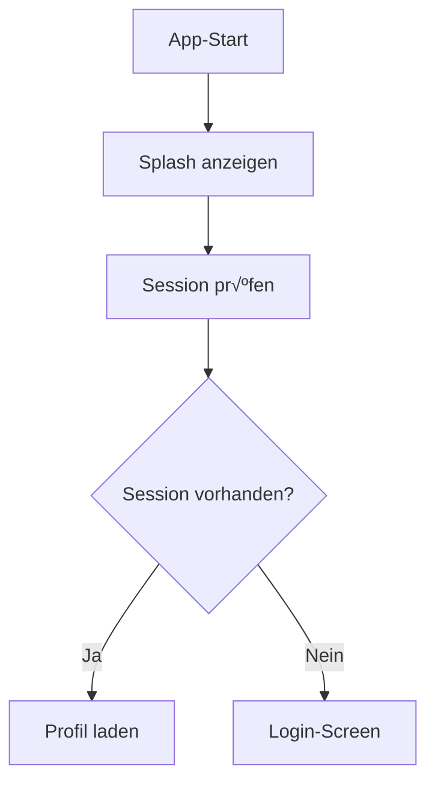
```mermaid
flowchart TD
    A["App-Start"] --> B["Splash anzeigen"]
    B --> C["Session prüfen"]
    C --> D{"Session vorhanden?"}
    D -->|Ja| E["Profil laden"]
    D -->|Nein| F["Login-Screen"]
```

---

## 7. Login (`LOGIN`)

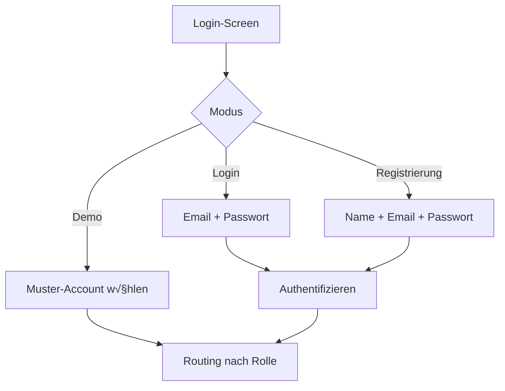
```mermaid
flowchart TD
    A["Login-Screen"] --> B{"Modus"}
    B -->|Login| C["Email + Passwort"]
    B -->|Registrierung| D["Name + Email + Passwort"]
    B -->|Demo| E["Muster-Account wählen"]
    C --> F["Authentifizieren"]
    D --> F
    E --> G["Routing nach Rolle"]
    F --> G
```

---

## 8. WG-Finder (`WG_FINDER`)

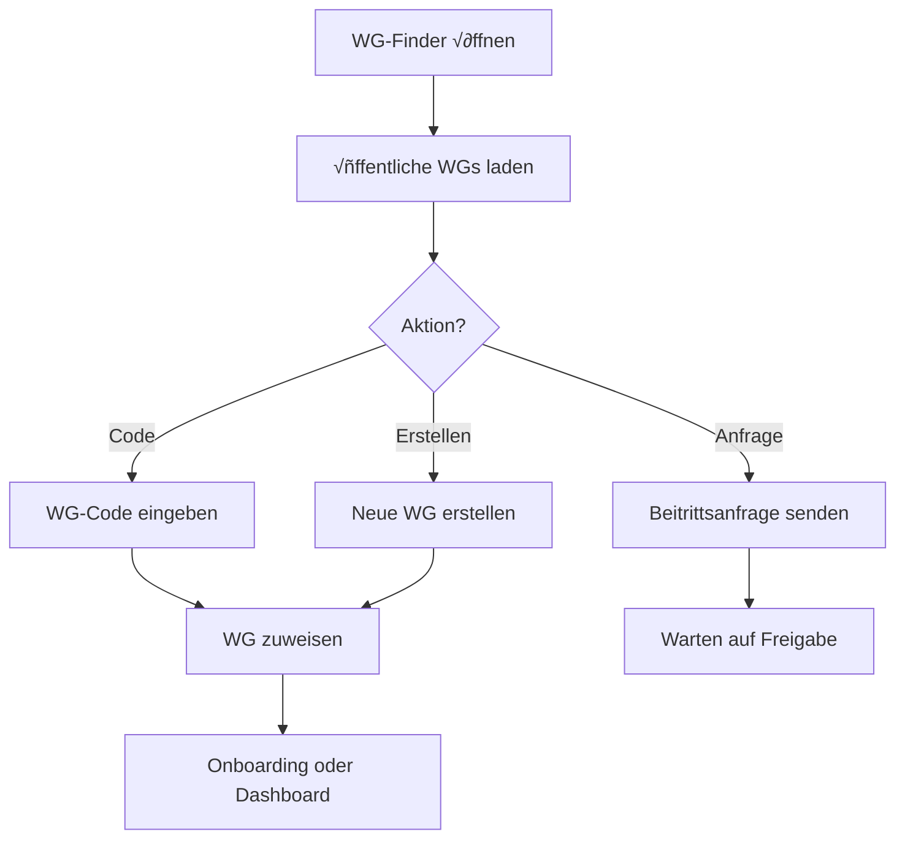
```mermaid
flowchart TD
    A["WG-Finder öffnen"] --> B["Öffentliche WGs laden"]
    B --> C{"Aktion?"}
    C -->|Code| D["WG-Code eingeben"]
    C -->|Anfrage| E["Beitrittsanfrage senden"]
    C -->|Erstellen| F["Neue WG erstellen"]
    D --> G["WG zuweisen"]
    F --> G
    E --> H["Warten auf Freigabe"]
    G --> I["Onboarding oder Dashboard"]
```

---

## 9. Dashboard (`DASHBOARD`)

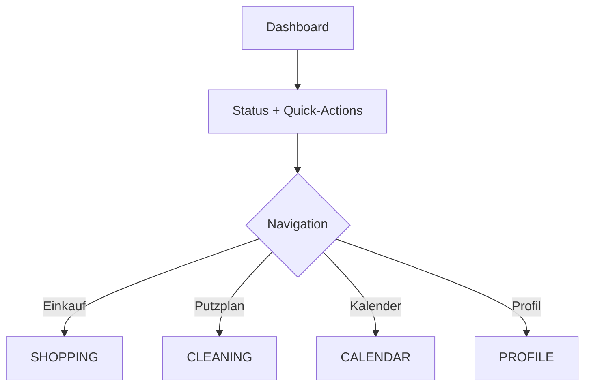
```mermaid
flowchart TD
    A["Dashboard"] --> B["Status + Quick-Actions"]
    B --> C{"Navigation"}
    C -->|Einkauf| D["SHOPPING"]
    C -->|Putzplan| E["CLEANING"]
    C -->|Kalender| F["CALENDAR"]
    C -->|Profil| G["PROFILE"]
```

---

## 10. Crew (`CREW`)

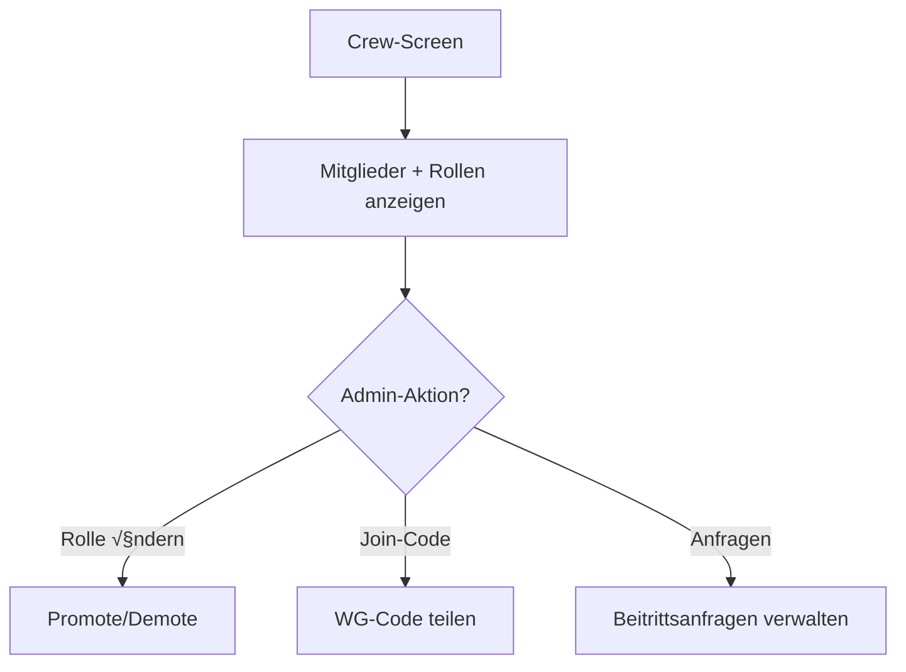
```mermaid
flowchart TD
    A["Crew-Screen"] --> B["Mitglieder + Rollen anzeigen"]
    B --> C{"Admin-Aktion?"}
    C -->|Rolle ändern| D["Promote/Demote"]
    C -->|Join-Code| E["WG-Code teilen"]
    C -->|Anfragen| F["Beitrittsanfragen verwalten"]
```

---

## 11. Essensplan (`MEAL_PLANNER`)

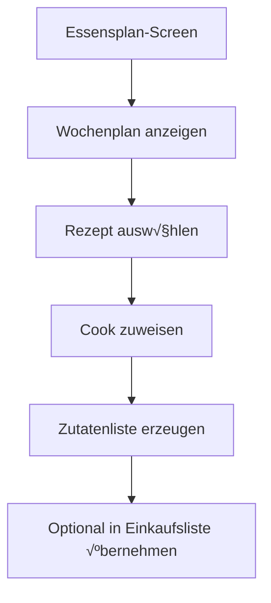
```mermaid
flowchart TD
    A["Essensplan-Screen"] --> B["Wochenplan anzeigen"]
    B --> C["Rezept auswählen"]
    C --> D["Cook zuweisen"]
    D --> E["Zutatenliste erzeugen"]
    E --> F["Optional in Einkaufsliste übernehmen"]
```

---

## 12. Tresor (`VAULT`)

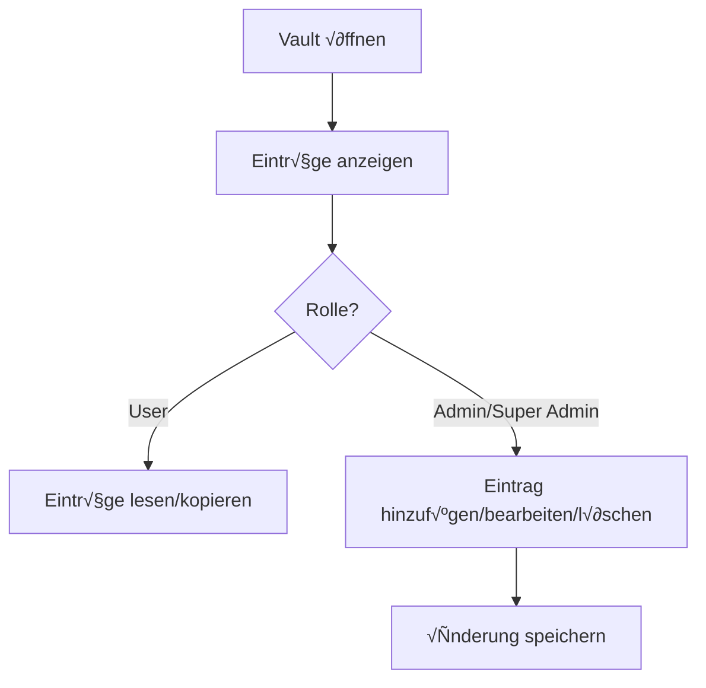
```mermaid
flowchart TD
    A["Vault öffnen"] --> B["Einträge anzeigen"]
    B --> C{"Rolle?"}
    C -->|User| D["Einträge lesen/kopieren"]
    C -->|Admin/Super Admin| E["Eintrag hinzufügen/bearbeiten/löschen"]
    E --> F["Änderung speichern"]
```

---

## 13. Belohnungen (`REWARDS`)

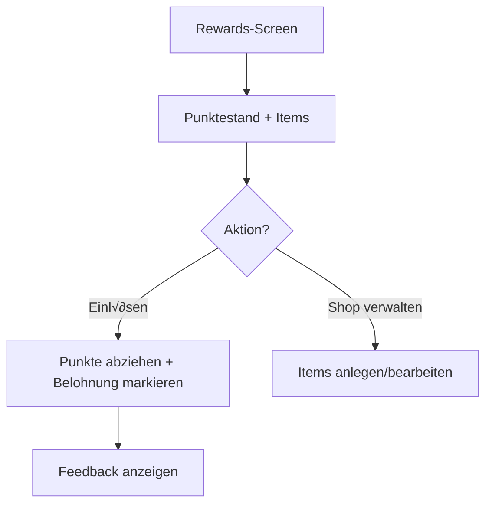
```mermaid
flowchart TD
    A["Rewards-Screen"] --> B["Punktestand + Items"]
    B --> C{"Aktion?"}
    C -->|Einlösen| D["Punkte abziehen + Belohnung markieren"]
    C -->|Shop verwalten| E["Items anlegen/bearbeiten"]
    D --> F["Feedback anzeigen"]
```

---

## 14. Analytics (`ANALYTICS`)

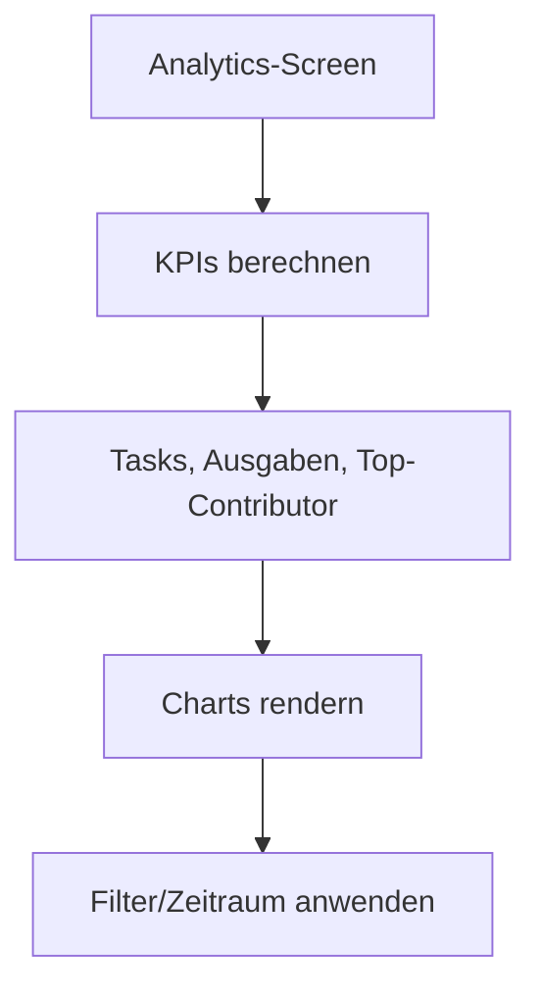
```mermaid
flowchart TD
    A["Analytics-Screen"] --> B["KPIs berechnen"]
    B --> C["Tasks, Ausgaben, Top-Contributor"]
    C --> D["Charts rendern"]
    D --> E["Filter/Zeitraum anwenden"]
```

---

## 15. Schwarzes Brett (`BLACKBOARD`)

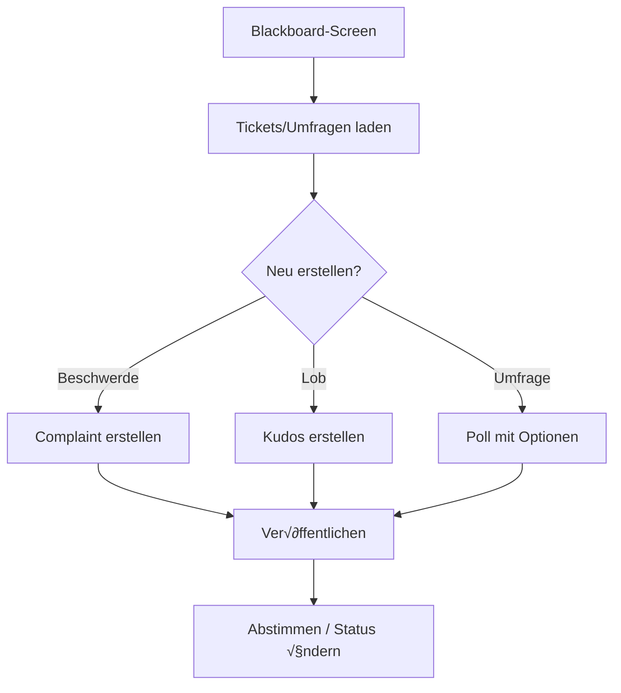
```mermaid
flowchart TD
    A["Blackboard-Screen"] --> B["Tickets/Umfragen laden"]
    B --> C{"Neu erstellen?"}
    C -->|Beschwerde| D["Complaint erstellen"]
    C -->|Lob| E["Kudos erstellen"]
    C -->|Umfrage| F["Poll mit Optionen"]
    D --> G["Veröffentlichen"]
    E --> G
    F --> G
    G --> H["Abstimmen / Status ändern"]
```

---

## 16. Profil (`PROFILE`)

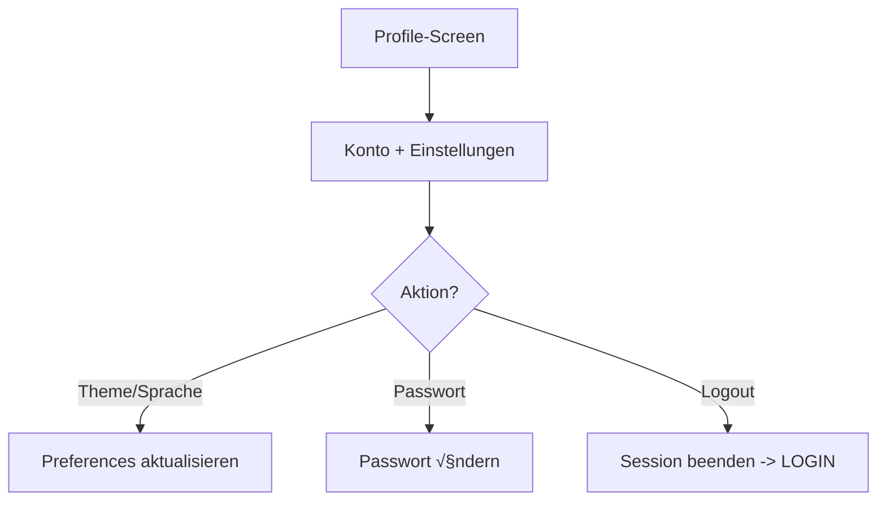
```mermaid
flowchart TD
    A["Profile-Screen"] --> B["Konto + Einstellungen"]
    B --> C{"Aktion?"}
    C -->|Theme/Sprache| D["Preferences aktualisieren"]
    C -->|Passwort| E["Passwort ändern"]
    C -->|Logout| F["Session beenden -> LOGIN"]
```

---

## 17. System-Panel (`SYSTEM_PANEL`)

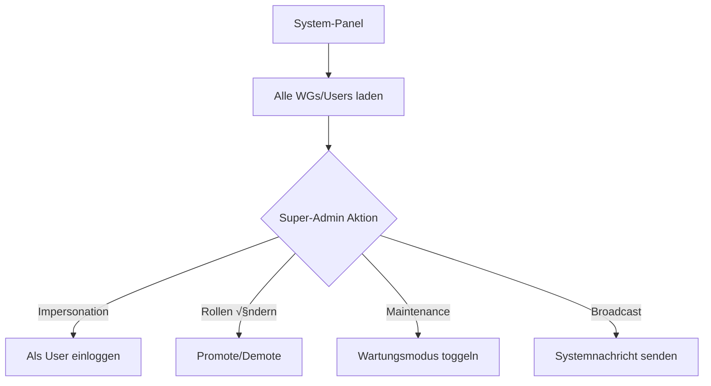
```mermaid
flowchart TD
    A["System-Panel"] --> B["Alle WGs/Users laden"]
    B --> C{"Super-Admin Aktion"}
    C -->|Impersonation| D["Als User einloggen"]
    C -->|Rollen ändern| E["Promote/Demote"]
    C -->|Maintenance| F["Wartungsmodus toggeln"]
    C -->|Broadcast| G["Systemnachricht senden"]
```

---

## 18. Fixkosten (`RECURRING_COSTS`)

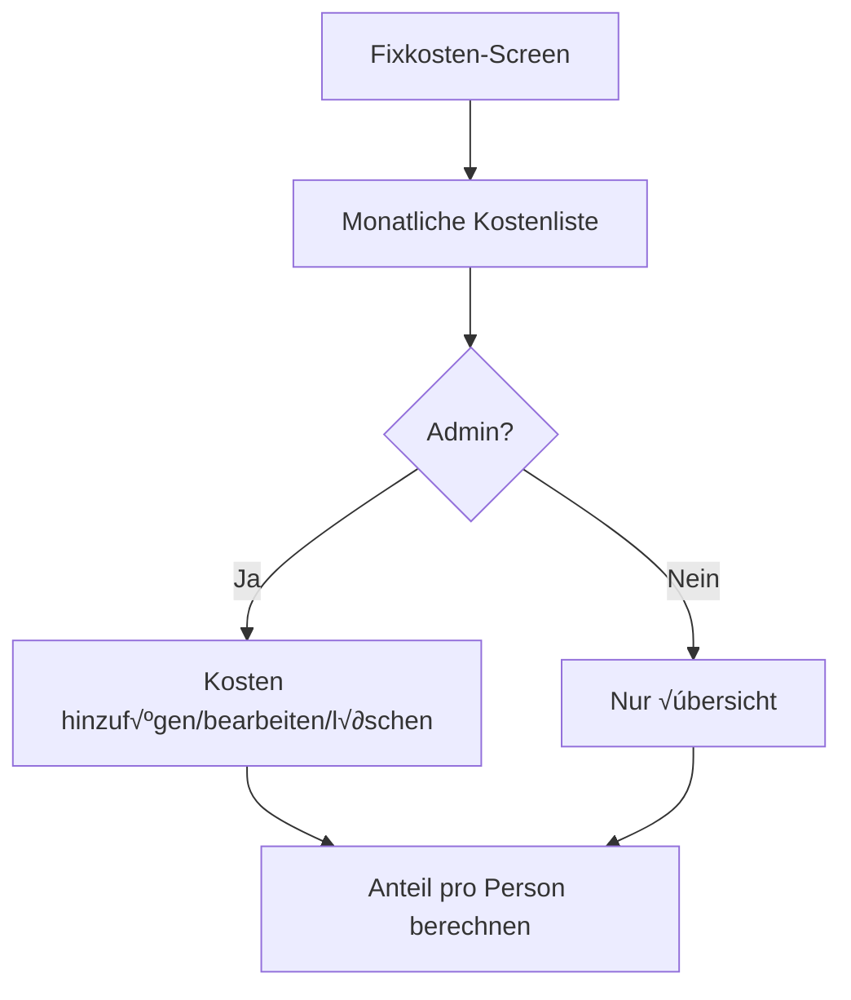
```mermaid
flowchart TD
    A["Fixkosten-Screen"] --> B["Monatliche Kostenliste"]
    B --> C{"Admin?"}
    C -->|Ja| D["Kosten hinzufügen/bearbeiten/löschen"]
    C -->|Nein| E["Nur √úbersicht"]
    D --> F["Anteil pro Person berechnen"]
    E --> F
```

---

## 19. Wall of Fame (`WALL_OF_FAME`)

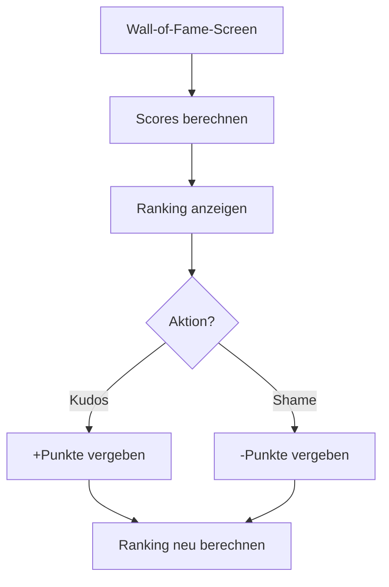
```mermaid
flowchart TD
    A["Wall-of-Fame-Screen"] --> B["Scores berechnen"]
    B --> C["Ranking anzeigen"]
    C --> D{"Aktion?"}
    D -->|Kudos| E["+Punkte vergeben"]
    D -->|Shame| F["-Punkte vergeben"]
    E --> G["Ranking neu berechnen"]
    F --> G
```

---

## 20. Gäste-Pass (`GUEST_PASS`)

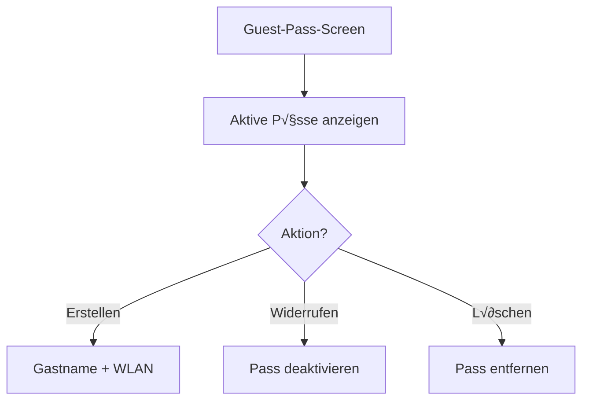
```mermaid
flowchart TD
    A["Guest-Pass-Screen"] --> B["Aktive Pässe anzeigen"]
    B --> C{"Aktion?"}
    C -->|Erstellen| D["Gastname + WLAN"]
    C -->|Widerrufen| E["Pass deaktivieren"]
    C -->|Löschen| F["Pass entfernen"]
```

---

## 21. Smart Home (`SMART_HOME`)

```mermaid
flowchart TD
    A["Smart-Home-Screen"] --> B["Szenen anzeigen"]
    B --> C{"Szene toggeln"}
    C -->|Aktivieren| D["Benachrichtigung/Ticket erzeugen"]
    C -->|Deaktivieren| E["Status speichern"]
```

---

## 22. Onboarding (`ONBOARDING`)

```mermaid
flowchart TD
    A["Onboarding starten"] --> B["Schritte laden"]
    B --> C["Regeln / IBAN / Putz-Tag / Avatar / Intro"]
    C --> D{"Alles erledigt?"}
    D -->|Ja| E["onboardingCompleted = true"]
    E --> F["Weiter zu DASHBOARD"]
    D -->|Nein| G["Fortschritt speichern"]
```

---

## 23. Funktionalitäten nach Kategorien

### A) Benutzerverwaltung & Sicherheit
- Muster-Login mit Demo-Accounts pro Rolle (User/Admin/Super Admin)
- Firebase Authentication (Email/Passwort, teilweise angebunden)
- Automatischer Login beim App-Start (falls Session verfügbar)
- Zwei-Faktor-Authentifizierung (2FA)
- Passwort-Zurücksetzen per Email
- Rollenbasierter Zugriff (User, Admin, Super Admin)
- Benutzer sperren/entsperren (Admin)
- Impersonation (Super Admin)

### B) Finanzen & Einkauf
- Gemeinsame Einkaufsliste mit Emoji-Kategorien
- Preiserfassung und automatische Kostenaufteilung
- Faire Bilanzberechnung (wer schuldet wem)
- Schulden einzeln oder komplett begleichen
- Monatliche Fixkosten mit Aufschlüsselung pro Kopf
- Budget-√úbersicht mit Fortschrittsbalken
- Schnelle Nachfüll-Vorschläge

### C) Haushalt & Organisation
- Putzplan mit automatischer Rotation
- XP-System und Streak-Belohnung
- Vorratskammer-Verwaltung (Voll/Niedrig/Leer)
- Essensplaner mit Wochenplan und Rezeptbuch
- Automatische Zutatenliste für Rezepte
- WG-Regeln (bearbeitbar)

### D) Kommunikation & Gemeinschaft
- Schwarzes Brett (Beschwerden, Kudos, Umfragen)
- Abstimmungssystem für Umfragen
- Kudos/Shame an Mitbewohner senden (±Punkte)
- Wall of Fame / Leaderboard
- Broadcasts (Super Admin)
- Smart-Home-Szenen mit Benachrichtigungen

### E) Datenpersistenz
- **Firebase Realtime Database** — Teilweise Cloud-Synchronisation
- **SQLite (LocalDatabase)** — Lokaler Offline-Cache mit 15 Tabellen
- **Lokale Persistenz zuerst** — Daten bleiben lokal nutzbar; Cloud-Sync erfolgt bei verfügbarer Anbindung
- **Offline-Modus** — Bei fehlendem Netzwerk werden lokale Daten/Mock-Daten geladen

### F) UX & Design
- Material 3 Design System
- 5 Farbthemen (Indigo, Emerald, Rose, Amber, Sky)
- Dark/Light Mode
- DE/EN Lokalisierung
- Animierte Übergänge zwischen Screens
- Emoji-basierte Kategorisierung
- Responsive Layout mit Edge-to-Edge Support
