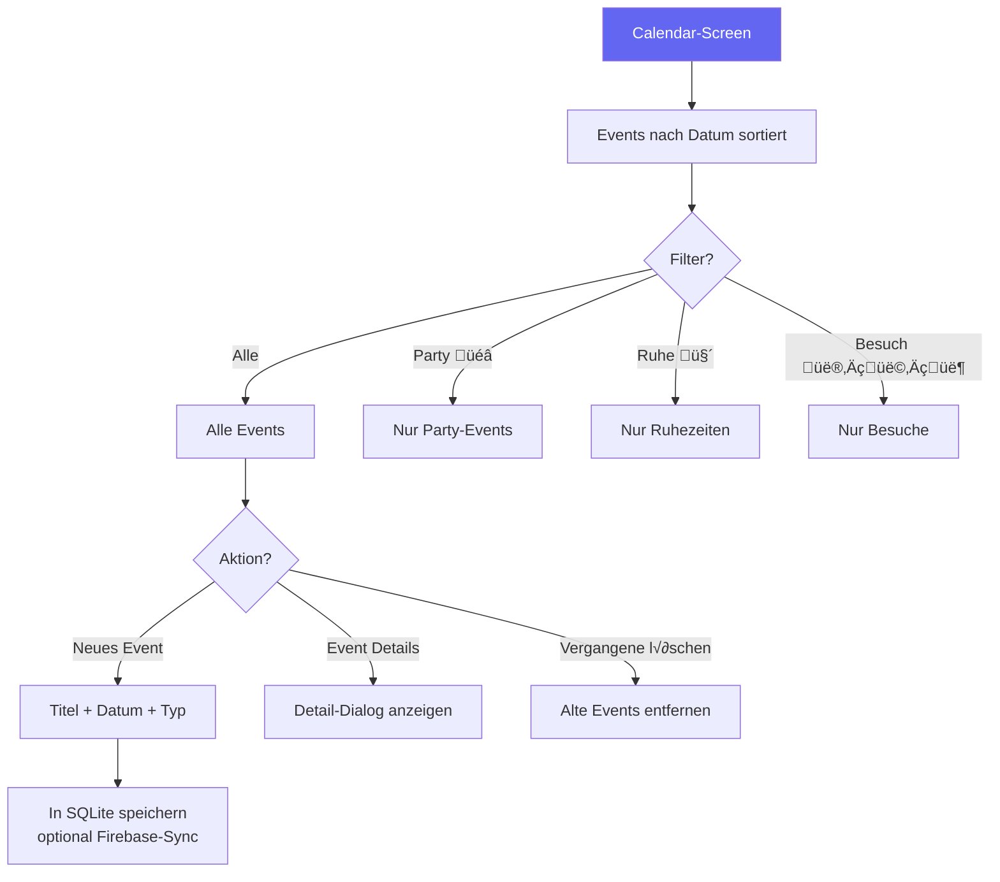

# WG Manager — Ablaufdiagramm

> Programmablauf und Funktionalitäten der WG Manager App.  
> Diagramme im [Mermaid](https://mermaid.js.org/)-Format — darstellbar auf GitHub, VS Code (Mermaid-Plugin) oder [mermaid.live](https://mermaid.live).
>
> **Hinweis (Projektstand SoSe 2026):** Die vollständige Ende-zu-Ende-Anbindung an Firebase wurde nicht abgeschlossen.  
> Für die Demo werden Muster-Zugangsdaten pro Rolle verwendet (Passwort: `1234`).

---

## 1. Hauptablauf der App

---

## 2. Authentifizierungsfluss

### Muster-Zugangsdaten und Rollen-Logik (Demo)

| Rolle | E-Mail | Passwort | Ziel nach Login | Wie es funktionieren soll |
| ----- | ------ | -------- | --------------- | ------------------------- |
| User | `max@wg.com` | `1234` | `DASHBOARD` | Normale WG-Nutzung: Aufgaben, Einkauf, Kalender, Profil |
| Admin | `admin@wg.com` | `1234` | `DASHBOARD` | Wie User, zusätzlich Admin-Aktionen (z. B. WG-Verwaltung/Fixkosten) |
| Super Admin | `super@wg.com` | `1234` | `SYSTEM_PANEL` | Globale Verwaltung: User/WGs verwalten, Impersonation, Wartung |
| User (ohne WG) | `new@wg.com` | `1234` | `WG_FINDER` | Zuerst WG beitreten/erstellen; danach ggf. `ONBOARDING`, dann `DASHBOARD` |

---

## 3. Einkauf & Finanzen

---

## 4. Putzplan / Aufgaben

---

## 5. Kalender

---

## 6. Alle 20 Screens

### Diagramm (alle Screens)

### Tabelle (Navigation)

| Nr. | Screen             | Enum-Wert         | Beschreibung                                    |
| --- | ------------------ | ----------------- | ----------------------------------------------- |
| 1   | Splash             | `SPLASH`          | Ladebildschirm mit Animation                    |
| 2   | Login              | `LOGIN`           | Anmeldung / Registrierung / 2FA + Muster-Accounts |
| 3   | WG-Finder          | `WG_FINDER`       | WG suchen, beitreten oder erstellen              |
| 4   | Dashboard          | `DASHBOARD`       | Hauptseite: Status, Quick-Actions, Events        |
| 5   | Einkauf            | `SHOPPING`        | Einkaufsliste, Bilanz, Vorratskammer             |
| 6   | Putzplan           | `CLEANING`        | Aufgaben-Verwaltung mit Rotation & XP            |
| 7   | Crew               | `CREW`            | Mitglieder-Liste, Rollen, WG-Details             |
| 8   | Kalender           | `CALENDAR`        | Gemeinsamer Kalender mit Event-Typen             |
| 9   | Essensplan         | `MEAL_PLANNER`    | Wochenplan + Rezepte + Auto-Einkaufsliste        |
| 10  | Tresor             | `VAULT`           | WiFi, IBAN, Codes — verschlüsselte Ansicht       |
| 11  | Belohnungen        | `REWARDS`         | Punkte-Shop für WG-Vorteile                      |
| 12  | Analytics          | `ANALYTICS`       | Statistiken und Diagramme                        |
| 13  | Schwarzes Brett    | `BLACKBOARD`      | Beschwerden, Lob, Umfragen                       |
| 14  | Profil             | `PROFILE`         | Persönliche Einstellungen, Theme, Sprache         |
| 15  | System-Panel       | `SYSTEM_PANEL`    | Super-Admin: alle WGs verwalten                  |
| 16  | Fixkosten          | `RECURRING_COSTS` | Monatliche Kosten aufteilen                      |
| 17  | Wall of Fame       | `WALL_OF_FAME`    | Leaderboard + Kudos/Shame                        |
| 18  | Gäste-Pass         | `GUEST_PASS`      | Zugangs-Codes für Besucher                       |
| 19  | Smart Home         | `SMART_HOME`      | Szenen-Steuerung (Movie Night etc.)              |
| 20  | Onboarding         | `ONBOARDING`      | Geführte Schritte für Neue                       |

---

## 7. Funktionalitäten nach Kategorien

### A) Benutzerverwaltung & Sicherheit
- Muster-Login mit Demo-Accounts pro Rolle (User/Admin/Super Admin)
- Firebase Authentication (Email/Passwort, teilweise angebunden)
- Automatischer Login beim App-Start (falls Session verfügbar)
- Zwei-Faktor-Authentifizierung (2FA)
- Passwort-Zurücksetzen per Email
- Rollenbasierter Zugriff (User, Admin, Super Admin)
- Benutzer sperren/entsperren (Admin)
- Impersonation (Super Admin)

### B) Finanzen & Einkauf
- Gemeinsame Einkaufsliste mit Emoji-Kategorien
- Preiserfassung und automatische Kostenaufteilung
- Faire Bilanzberechnung (wer schuldet wem)
- Schulden einzeln oder komplett begleichen
- Monatliche Fixkosten mit Aufschlüsselung pro Kopf
- Budget-Übersicht mit Fortschrittsbalken
- Schnelle Nachfüll-Vorschläge

### C) Haushalt & Organisation
- Putzplan mit automatischer Rotation
- XP-System und Streak-Belohnung
- Vorratskammer-Verwaltung (Voll/Niedrig/Leer)
- Essensplaner mit Wochenplan und Rezeptbuch
- Automatische Zutatenliste für Rezepte
- WG-Regeln (bearbeitbar)

### D) Kommunikation & Gemeinschaft
- Schwarzes Brett (Beschwerden, Kudos, Umfragen)
- Abstimmungssystem für Umfragen
- Kudos/Shame an Mitbewohner senden (±Punkte)
- Wall of Fame / Leaderboard
- Broadcasts (Super Admin)
- Smart-Home-Szenen mit Benachrichtigungen

### E) Datenpersistenz
- **Firebase Realtime Database** — Teilweise Cloud-Synchronisation
- **SQLite (LocalDatabase)** — Lokaler Offline-Cache mit 15 Tabellen
- **Lokale Persistenz zuerst** — Daten bleiben lokal nutzbar; Cloud-Sync erfolgt bei verfügbarer Anbindung
- **Offline-Modus** — Bei fehlendem Netzwerk werden lokale Daten/Mock-Daten geladen

### F) UX & Design
- Material 3 Design System
- 5 Farbthemen (Indigo, Emerald, Rose, Amber, Sky)
- Dark/Light Mode
- DE/EN Lokalisierung
- Animierte Übergänge zwischen Screens
- Emoji-basierte Kategorisierung
- Responsive Layout mit Edge-to-Edge Support

